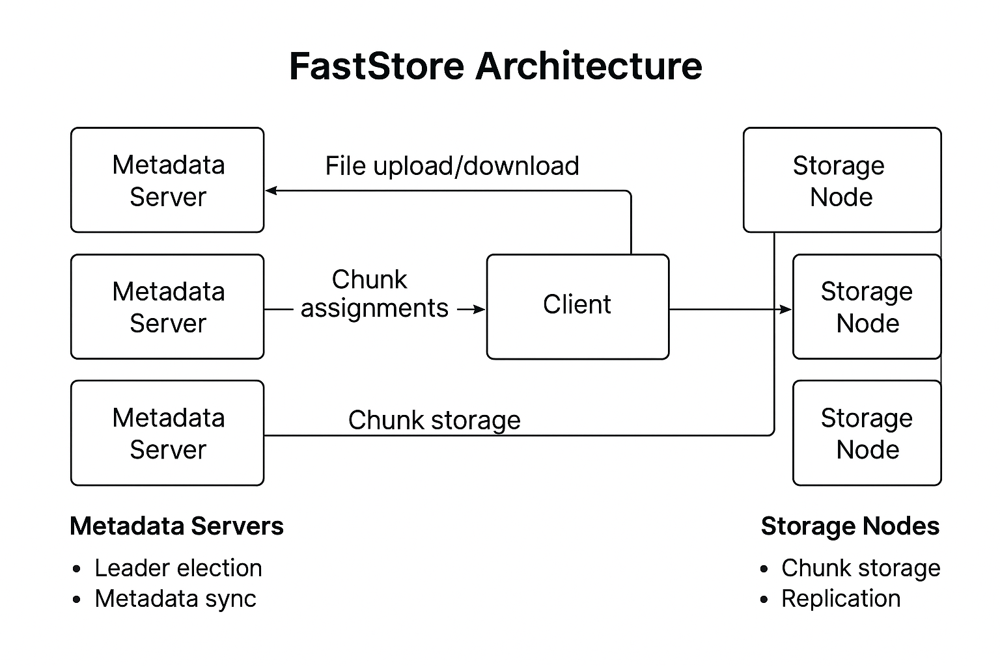

# FastStore: A Lightweight Distributed File System in Go

**FastStore** is a minimal distributed file system designed to demonstrate core principles of distributed systems including chunking, replication, fault tolerance, leader election, and metadata consistency. Built using Go, gRPC, Protocol Buffers, and the Raft consensus algorithm, this project serves as both an educational resource and a resume-quality implementation of a distributed storage architecture.

---

## Features

- **Chunk-based Storage**: Files are split into fixed-size chunks for distribution across nodes.
- **Replication**: Each chunk is stored on multiple storage nodes to ensure fault tolerance.
- **Metadata Management**: A centralized metadata service coordinates chunk assignments and tracks file-to-chunk mappings.
- **Consistent Hashing**: Efficient node-to-chunk mapping with O(log n) complexity to support dynamic scaling.
- **Leader Election**: Built-in leader election using the Raft protocol to synchronize metadata across multiple replicas.
- **gRPC Communication**: Efficient inter-service communication using Protocol Buffers and gRPC.

---

## Architecture Overview


The system consists of three core components:

1. **Metadata Servers**  
   - Handle file uploads and assign chunks to storage nodes.  
   - Participate in Raft consensus for leader election and metadata synchronization.

2. **Storage Nodes**  
   - Store chunk data and respond to client read/write requests.  
   - Each node holds a subset of chunks with replication.

3. **Client Interface**  
   - Uploads/downloads files.  
   - Communicates with metadata servers to retrieve chunk mappings and transfer data from storage nodes.

## Architecture Diagram




---

## Technologies Used

- Go 
- gRPC and Protocol Buffers
- Raft (Hashicorp’s Raft implementation)
- Consistent Hashing
- Docker

---

## How to Run

1. **Clone the Repository**

   ```bash
   git clone https://github.com/suryacs719/faststore-go.git
   cd faststore-go
2. Install Go Dependencies
     ```bash
     go mod tidy
3. Run the System
   ```bash
   go run ./cmd

This will do the following:
  - Start 3 Raft nodes for metadata coordination.

  - Start 3 gRPC storage servers.

  - Upload a test file, split it into chunks, replicate them, and verify retrieval.


Example Output:
```bash
Metadata Server listening on :50051
Node started at :50051
Election won: leader at 127.0.0.1:50062
Retrieved file: Hello, this is a test file for FastStore!
